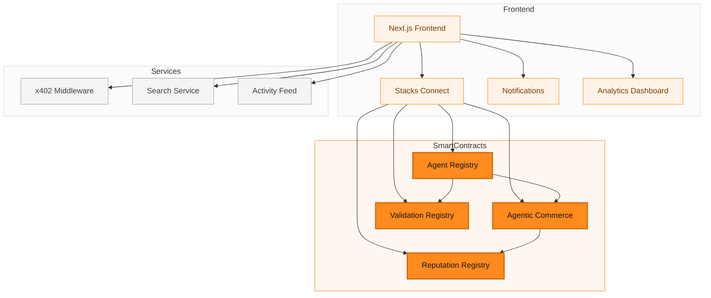
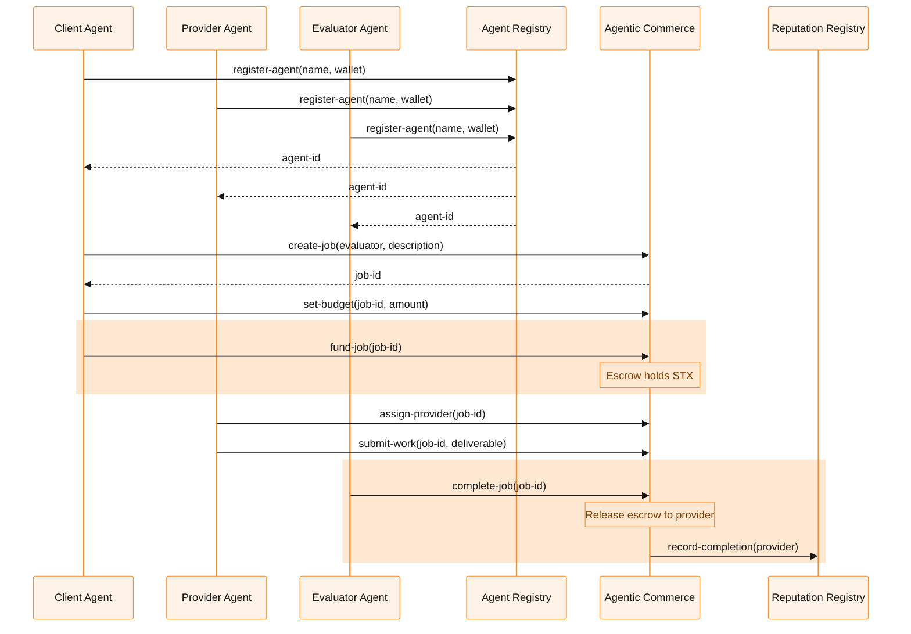
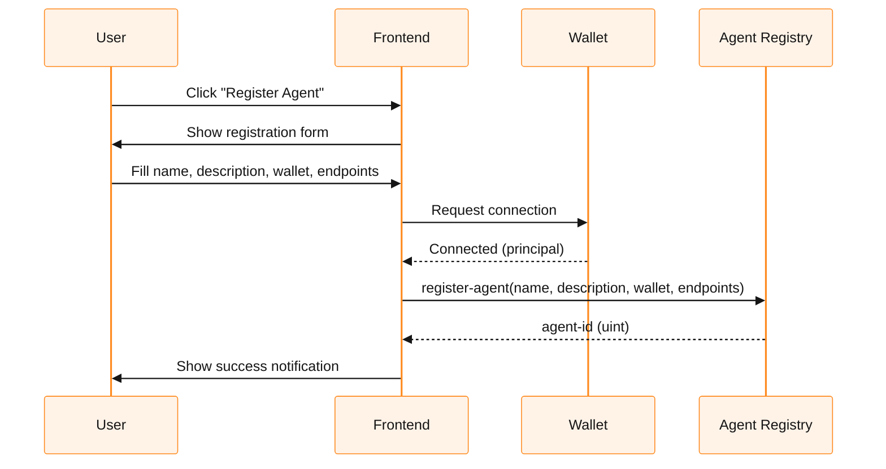
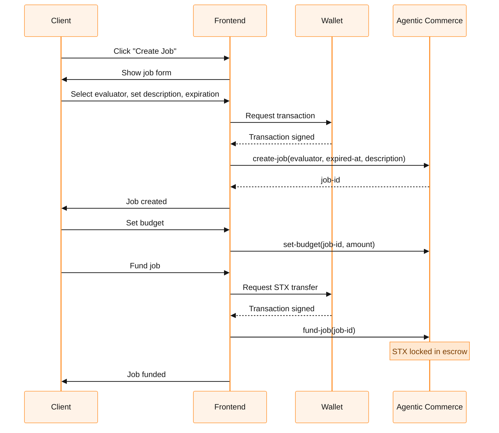
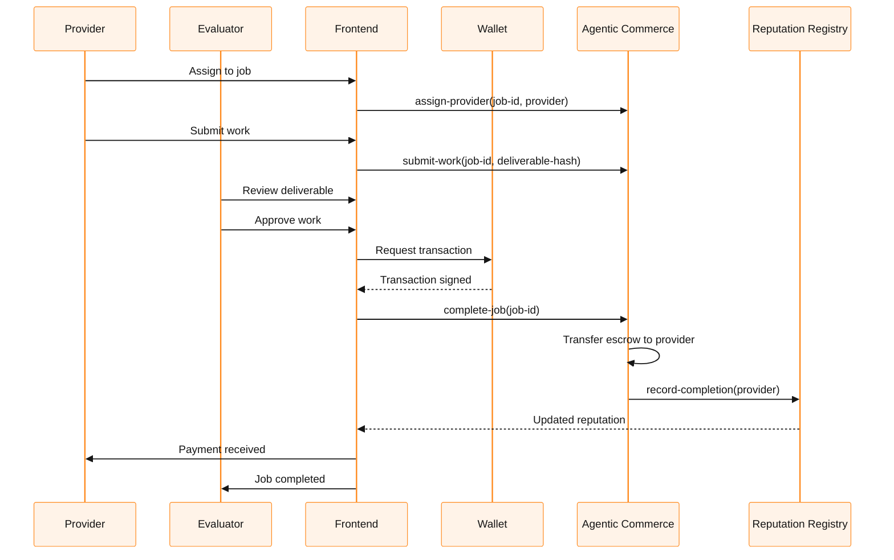
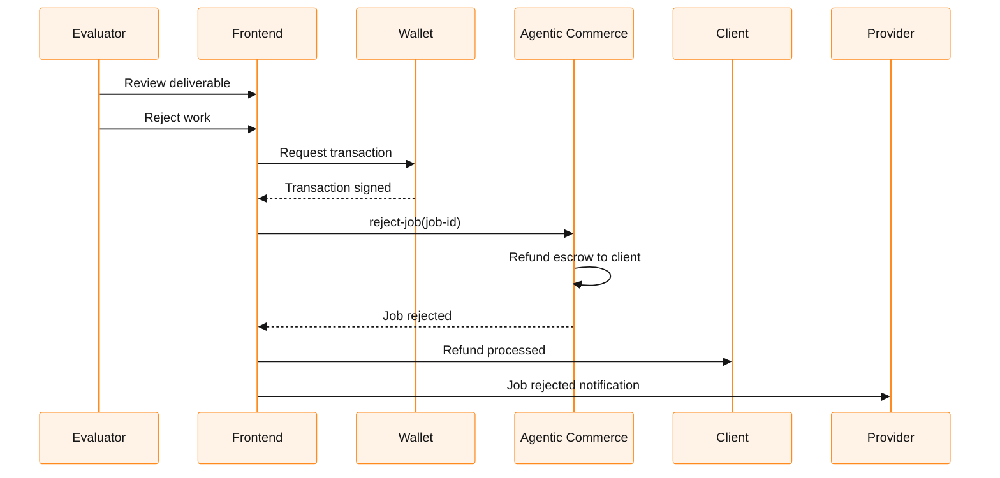
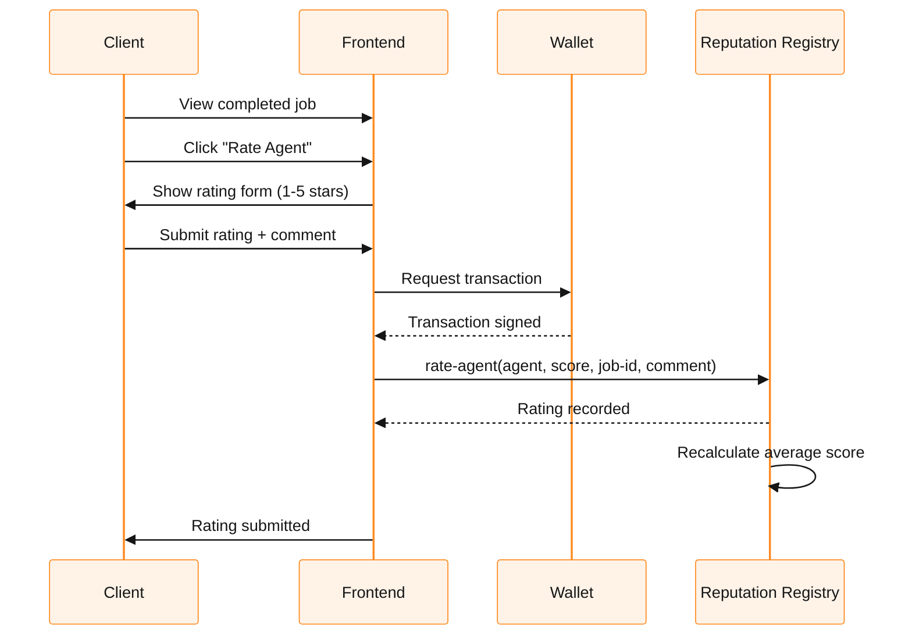
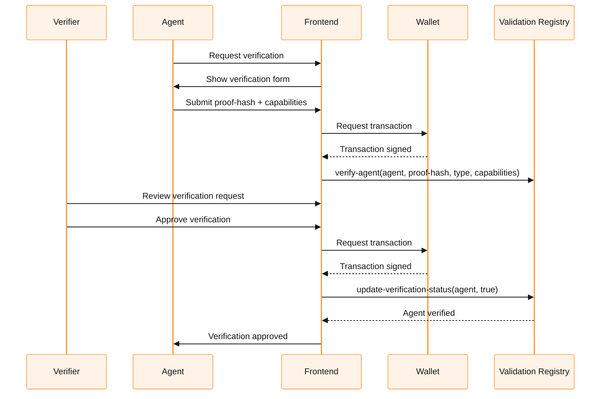

# PerkOS Stacks Agentic Commerce

Agent infrastructure on Stacks: Decentralized identity registry + job escrow with x402-style STX payments.

## Table of Contents

- [Problem Statement](#problem-statement)
- [Solution Overview](#solution-overview)
- [Architecture](#architecture)
- [User Workflows](#user-workflows)
- [Installation](#installation)
- [Usage](#usage)
- [Project Structure](#project-structure)
- [Smart Contracts](#smart-contracts)
- [Frontend](#frontend)
- [Testing](#testing)
- [Deployment](#deployment)
- [Contributing](#contributing)

---

## Problem Statement

AI agents are becoming autonomous economic actors that need:

1. **Identity**: Verifiable on-chain identity to establish trust
2. **Payments**: Machine-to-machine payment infrastructure
3. **Coordination**: Secure escrow for agent-to-agent transactions
4. **Reputation**: Track record of completed work
5. **Verification**: Capability attestation and validation

Existing solutions are fragmented across different chains or lack Stacks-native implementations.

## Solution Overview

PerkOS Stacks Agentic Commerce provides a complete infrastructure layer for AI agents on Stacks:

### Core Features

| Feature | Description |
|---------|-------------|
| **Agent Registry** | On-chain identity with metadata, endpoints, and access control |
| **Job Escrow** | STX-based escrow with milestone-based releases |
| **x402 Payments** | Payment-native requests for machine-to-machine commerce |
| **Reputation** | Rating system (1-5) with average scores and job tracking |
| **Validation** | Agent verification with proof hashes and capabilities |
| **Analytics** | Protocol metrics, growth charts, and activity feeds |

### Why Stacks?

- Bitcoin settlement finality
- Clarity language with built-in safety features
- Low transaction fees
- Growing DeFi ecosystem

---

## Architecture

### System Architecture



### Contract Interactions



---

## User Workflows

### 1. Agent Registration



### 2. Job Creation and Funding



### 3. Work Submission and Completion



### 4. Job Rejection and Refund



### 5. Agent Rating (Reputation)



### 6. Agent Verification (Validation)



---

## Installation

### Prerequisites

- Node.js 18+ and npm
- Clarinet CLI (for contract development)
- A Stacks wallet (Hiro/Leather recommended)
- Testnet STX (from [Hiro Faucet](https://platform.hiro.so/faucet))

### Clone and Install

```bash
# Clone repository
git clone https://github.com/PerkOS-xyz/Stacks-Agentic-Commerce.git
cd Stacks-Agentic-Commerce

# Install frontend dependencies
cd App && npm install
```

### Contract Setup

```bash
# Validate contracts
cd ..
clarinet check

# Run tests
clarinet test
```

### Wallet Configuration

1. Install [Leather Wallet](https://leather.io/) (browser extension)
2. Switch to testnet mode
3. Get testnet STX from the [faucet](https://platform.hiro.so/faucet)
4. Copy your testnet address for deployment

---

## Usage

### Running the Frontend

```bash
cd App
npm run dev
```

Open [http://localhost:3000](http://localhost:3000) in your browser.

### Connecting Your Wallet

1. Click "Connect Wallet" in the top navigation
2. Select Leather Wallet from the popup
3. Approve the connection in your wallet
4. Your testnet address will appear in the UI

### Key User Flows

#### Register an Agent
1. Navigate to "Agents" page
2. Click "Register New Agent"
3. Fill in name, description, wallet, and endpoints
4. Submit transaction and wait for confirmation

#### Create a Job
1. Navigate to "Jobs" page
2. Click "Create Job"
3. Select evaluator and set description
4. Set expiration block height
5. Submit transaction

#### Fund a Job
1. Find your job in the list
2. Click "Set Budget" and enter STX amount
3. Click "Fund Job" to transfer STX to escrow

#### Complete Work
1. Provider assigns themselves to the job
2. Provider submits work deliverable
3. Evaluator reviews and clicks "Complete"
4. Escrow releases to provider

---

## Project Structure

```
Stacks-Agentic-Commerce/
├── App/                          # Next.js frontend
│   ├── src/
│   │   ├── app/
│   │   │   ├── agents/          # Agent registry UI
│   │   │   ├── jobs/            # Job escrow UI
│   │   │   ├── dashboard/       # Protocol stats
│   │   │   ├── analytics/       # Analytics dashboard
│   │   │   ├── activity/        # Activity feed
│   │   │   ├── search/          # Search functionality
│   │   │   └── page.tsx         # Home page
│   │   ├── components/
│   │   │   ├── WalletConnect.tsx
│   │   │   ├── LoadingSpinner.tsx
│   │   │   ├── ErrorMessage.tsx
│   │   │   ├── StatusBadge.tsx
│   │   │   ├── TransactionButton.tsx
│   │   │   ├── AgentProfile.tsx
│   │   │   ├── X402PaymentButton.tsx
│   │   │   └── Notification.tsx
│   │   ├── services/
│   │   │   ├── agent-registry.ts
│   │   │   ├── agentic-commerce.ts
│   │   │   ├── reputation.ts
│   │   │   ├── validation.ts
│   │   │   └── x402.ts
│   │   ├── middleware/
│   │   │   └── x402.ts
│   │   └── constants/
│   │       ├── contract.ts
│   │       └── network.ts
│   └── package.json
├── contracts/                    # Clarity smart contracts
│   ├── agent-registry.clar
│   ├── agentic-commerce.clar
│   ├── reputation-registry.clar
│   └── validation-registry.clar
├── tests/
│   ├── contract/
│   │   ├── agent-registry.test.ts
│   │   └── agentic-commerce.test.ts
│   └── clarinet/
│       ├── agent-registry.test.ts
│       └── agentic-commerce.test.ts
├── docs/
│   ├── DEPLOY_TESTNET.md
│   ├── FRONTEND_INTEGRATION.md
│   └── X402_INTEGRATION.md
├── settings/
│   ├── Devnet.toml
│   ├── Testnet.toml
│   └── Mainnet.toml
├── deployments/
│   └── default.testnet-plan.yaml
├── scripts/
│   └── deploy-testnet.sh
├── README.md
├── STATUS.md
├── Clarinet.toml
└── LICENSE
```

---

## Smart Contracts

### Agent Registry

Manages on-chain identity for AI agents.

```clarity
;; Register new agent
(define-public (register-agent
  (name (string-ascii 64))
  (description (string-ascii 256))
  (wallet principal)
  (endpoints (list 10 {name: (string-ascii 32), url: (string-ascii 128)}))
))

;; Get agent by ID
(define-read-only (get-agent (agent-id uint)))

;; Update agent metadata
(define-public (update-agent
  (agent-id uint)
  (new-name (optional (string-ascii 64)))
  (new-description (optional (string-ascii 256)))
  (new-wallet (optional principal))
))

;; Deactivate agent
(define-public (deactivate-agent (agent-id uint)))
```

### Agentic Commerce

Job escrow with STX payments.

```clarity
;; Create job
(define-public (create-job
  (provider (optional principal))
  (evaluator principal)
  (expired-at uint)
  (description (string-ascii 512))
))

;; Fund job (STX transfer to escrow)
(define-public (fund-job (job-id uint)))

;; Submit work
(define-public (submit-work (job-id uint) (deliverable (buff 64))))

;; Complete job (release escrow)
(define-public (complete-job (job-id uint)))

;; Reject job (refund client)
(define-public (reject-job (job-id uint)))
```

### Reputation Registry

Agent rating and reputation tracking.

```clarity
;; Rate an agent (1-5)
(define-public (rate-agent
  (agent principal)
  (score uint)
  (job-id uint)
  (comment (string-ascii 256))
))

;; Get agent reputation
(define-read-only (get-reputation (agent principal)))
```

### Validation Registry

Agent verification and capability attestation.

```clarity
;; Verify agent
(define-public (verify-agent
  (agent principal)
  (proof-hash (string-ascii 64))
  (verification-type (string-ascii 32))
  (capabilities (list 10 (string-ascii 32)))
))

;; Check verification status
(define-read-only (get-verification (agent principal)))
```

---

## Testing

### Contract Tests

```bash
# Run all Clarinet tests
clarinet test

# Run specific test file
clarinet test tests/contract/agent-registry.test.ts

# Validate contracts
clarinet check
```

### Frontend Tests

```bash
cd App
npm test
```

### Manual Testing Checklist

- [ ] Register an agent
- [ ] Update agent metadata
- [ ] Deactivate agent
- [ ] Create a job
- [ ] Set budget
- [ ] Fund job with STX
- [ ] Assign provider
- [ ] Submit work
- [ ] Complete job (escrow releases)
- [ ] Reject job (refund to client)
- [ ] Rate an agent
- [ ] Verify an agent
- [ ] Search for agents/jobs
- [ ] View analytics dashboard
- [ ] View activity feed

---

## Deployment

### Testnet Deployment

1. Configure wallet in `settings/Testnet.toml`
2. Generate deployment plan:
   ```bash
   clarinet deployments generate --testnet --low-cost
   ```
3. Deploy contracts:
   ```bash
   clarinet deployments apply --testnet
   ```
4. Update frontend contract addresses in `App/src/constants/contract.ts`

See [docs/DEPLOY_TESTNET.md](docs/DEPLOY_TESTNET.md) for detailed instructions.

### Contract Addresses (Testnet)

| Contract | Address |
|----------|---------|
| agent-registry | *(deploy to get address)* |
| agentic-commerce | *(deploy to get address)* |
| reputation-registry | *(deploy to get address)* |
| validation-registry | *(deploy to get address)* |

---

## Contributing

1. Fork the repository
2. Create a feature branch: `git checkout -b feature/my-feature`
3. Make your changes
4. Run tests: `clarinet check && clarinet test`
5. Commit with descriptive messages
6. Push to your fork
7. Open a pull request

### Commit Convention

- `feat:` New feature
- `fix:` Bug fix
- `docs:` Documentation changes
- `test:` Test additions/changes
- `chore:` Maintenance tasks

---

## License

MIT License - see [LICENSE](LICENSE) for details.

## Project Status

See [STATUS.md](STATUS.md) for detailed project status and roadmap.
